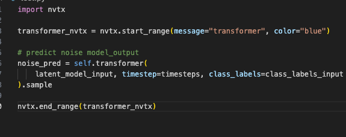

# 当前结果
~~~text
Generating CUDA API Statistics...
CUDA API Statistics (nanoseconds)

Time(%)      Total Time       Calls         Average         Minimum         Maximum  Name                                                                            
-------  --------------  ----------  --------------  --------------  --------------  --------------------------------------------------------------------------------
   50.3      1709124966         195       8764743.4            2450      1707272594  cudaMalloc                                                                      
   23.0       780254116           6     130042352.7             330       598464963  cudaFree                                                                        
   15.2       514550903           8      64318862.9            1320       514454323  cudaStreamCreateWithFlags                                                       
   11.1       377387837         602        626890.1            1760        28089863  cuModuleUnload                                                                  
    0.3         9910019           1       9910019.0         9910019         9910019  cudaHostAlloc                                                                   
    0.1         2100644         258          8142.0            3540           39670  cudaMemcpy                                                                      
    0.1         1798852         136         13226.9            4130          689241  cudaLaunchKernel                                                                
    0.0          617821          40         15445.5           13040           39580  cudaMemGetInfo                                                                  
    0.0          381730          56          6816.6            3870           24140  cudaMemcpyAsync                                                                 
    0.0           31410          78           402.7             290            1480  cudaEventCreateWithFlags                                                        
    0.0           18010           2          9005.0            2250           15760  cudaStreamCreateWithPriority                                                    
    0.0           16400           7          2342.9            1240            4670  cudaStreamSynchronize                                                           
    0.0            3200           3          1066.7             780            1410  cuInit                                                                          

Generating CUDA Kernel Statistics...
CUDA Kernel Statistics (nanoseconds)

Time(%)      Total Time   Instances         Average         Minimum         Maximum  Name                                                                                                                                                                                                                                                                                                                                         
-------  --------------  ----------  --------------  --------------  --------------  --------------------------------------------------------------------------------------------------------------------                                                                                                                                                                                                                         
   18.3           58366           6          9727.7            2784           17215  void phi::BNForwardInference<float, (common::DataLayout)2>(float const*, phi::backends::gpu::CudnnDataType<float>::BatchNormParamType const*, phi::backends::gpu::CudnnDataType<float>::BatchNormParamType const*, phi::backends::gpu::CudnnDataType<float>::BatchNormParamType const*, phi::backends::gpu::CudnnDataType<float>::BatchNormPa
    9.1           29184          30           972.8             960             993  void phi::funcs::VectorizedElementwiseKernel<float, phi::FullFunctor<float, float>, 0, 1, 4>(common::Array<char const* restrict, 0>, common::Array<float*, 1>, long, long, int, phi::FullFunctor<float, float>)                                                                                                                              
    9.1           28960           3          9653.3            9440            9824  void cutlass::Kernel<cutlass_80_tensorop_s1688gemm_64x64_32x6_nn_align1>(cutlass_80_tensorop_s1688gemm_64x64_32x6_nn_align1::Params)                                                                                                                                                                                                         
    7.6           24415           3          8138.3            7551            8864  void phi::funcs::GatherNdCUDAKernel<float, int>(float const*, common::Dim<9>, int const*, float*, unsigned long, unsigned long, unsigned long)                                                                                                                                                                                               
    6.0           19072          16          1192.0            1088            1472  void phi::funcs::VectorizedElementwiseKernel<int, phi::ScaleFunctor<int, int>, 1, 1, 4>(common::Array<char const* restrict, 1>, common::Array<int*, 1>, long, long, int, phi::ScaleFunctor<int, int>)                                                                                                                                        
    5.6           17856          11          1623.3            1344            2144  void phi::funcs::ReduceHigherDimKernel<float, float, float, phi::kps::AddFunctor<float>, phi::kps::IdentityFunctor<float, float> >(float const*, float*, phi::kps::AddFunctor<float>, phi::kps::IdentityFunctor<float, float>, float, int, int, int, phi::kps::DimConfig, int, bool, float*, bool)                                           
    5.4           17374           8          2171.8            1823            2975  void phi::funcs::VectorizedElementwiseKernel<float, phi::funcs::CudaSoftplusFunctor<float>, 1, 1, 4>(common::Array<char const* restrict, 1>, common::Array<float*, 1>, long, long, int, phi::funcs::CudaSoftplusFunctor<float>)                                                                                                              
    5.4           17311           8          2163.9            2080            2240  void phi::funcs::GatherNdCUDAKernel<float, long>(float const*, common::Dim<9>, long const*, float*, unsigned long, unsigned long, unsigned long)                                                                                                                                                                                             
    5.1           16320           3          5440.0            5088            5760  void phi::funcs::ConcatTensorWithDifferentShape<int, 4, phi::funcs::PointerAndColWrapper<float, int, 4> >(phi::funcs::PointerAndColWrapper<float, int, 4>, int, int, int, void*)                                                                                                                                                             
    4.7           15040           8          1880.0            1344            2688  void phi::funcs::VectorizedBroadcastKernel<phi::funcs::AddFunctor<float>, float, 2, 1, 4, 1>(common::Array<char const* restrict, 2>, common::Array<float*, 1>, common::Array<bool, 2>, unsigned int, common::Array<phi::kps::details::BroadcastConfig, 2>, int, int, int, phi::funcs::AddFunctor<float>)                                     
    3.0            9472           3          3157.3            3008            3328  void phi::funcs::SplitTensorWithDifferentShape<float, int, phi::funcs::PointerArray<float, (phi::funcs::SegmentedArraySize)4>, phi::funcs::ValueArray<int, (phi::funcs::SegmentedArraySize)4, 4> >(float const*, int, int, phi::funcs::PointerArray<float, (phi::funcs::SegmentedArraySize)4>, phi::funcs::ValueArray<int, (phi::funcs::Segme
    2.9            9280           2          4640.0            4000            5280  void cutlass::Kernel<cutlass_80_tensorop_s1688gemm_64x64_16x6_nn_align4>(cutlass_80_tensorop_s1688gemm_64x64_16x6_nn_align4::Params)                                                                                                                                                                                                         
    2.7            8768           6          1461.3            1249            1664  void phi::funcs::DistributionKernel<float, phi::funcs::uniform_distribution<float>, phi::funcs::uniform_real_transform<float> >(unsigned long, unsigned long, unsigned long, phi::funcs::uniform_distribution<float>, phi::funcs::uniform_real_transform<float>, float*, unsigned long)                                                      
    2.1            6848           1          6848.0            6848            6848  void cutlass::Kernel<cutlass_80_tensorop_s1688gemm_64x64_16x6_tt_align1>(cutlass_80_tensorop_s1688gemm_64x64_16x6_tt_align1::Params)                                                                                                                                                                                                         
    1.7            5504           3          1834.7            1793            1887  void phi::funcs::VectorizedElementwiseKernel<float, phi::funcs::CudaSigmoidFunctor<float>, 1, 1, 4>(common::Array<char const* restrict, 1>, common::Array<float*, 1>, long, long, int, phi::funcs::CudaSigmoidFunctor<float>)                                                                                                                
    1.6            5152           3          1717.3            1696            1760  void phi::funcs::VectorizedBroadcastKernel<phi::kps::IdentityFunctor<float, float>, float, 1, 1, 4, 1>(common::Array<char const* restrict, 1>, common::Array<float*, 1>, common::Array<bool, 1>, unsigned int, common::Array<phi::kps::details::BroadcastConfig, 1>, int, int, int, phi::kps::IdentityFunctor<float, float>)                 
    1.5            4895           3          1631.7            1568            1695  void phi::funcs::VectorizedBroadcastKernel<phi::funcs::MultiplyFunctor<float>, float, 2, 1, 4, 3>(common::Array<char const* restrict, 2>, common::Array<float*, 1>, common::Array<bool, 2>, unsigned int, common::Array<phi::kps::details::BroadcastConfig, 2>, int, int, int, phi::funcs::MultiplyFunctor<float>)                           
    1.2            3968           3          1322.7            1312            1344  void cub::DeviceReduceSingleTileKernel<cub::DeviceReducePolicy<float, float, int, phi::kps::AddFunctor<float> >::Policy600, cub::TransformInputIterator<float, phi::kps::DivideFunctor<float, float>, float const*, long>, float*, int, phi::kps::AddFunctor<float>, float>(cub::TransformInputIterator<float, phi::kps::DivideFunctor<float,
    1.2            3744           3          1248.0            1184            1376  void phi::funcs::VectorizedBroadcastKernel<phi::funcs::AddFunctor<float>, float, 2, 1, 4, 3>(common::Array<char const* restrict, 2>, common::Array<float*, 1>, common::Array<bool, 2>, unsigned int, common::Array<phi::kps::details::BroadcastConfig, 2>, int, int, int, phi::funcs::AddFunctor<float>)                                     
    1.1            3456           2          1728.0            1440            2016  void phi::funcs::StackCudaKernel<float, int, phi::funcs::ConstPointerArray<float, (phi::funcs::SegmentedArraySize)8> >(phi::funcs::ConstPointerArray<float, (phi::funcs::SegmentedArraySize)8>, phi::funcs::GeneralDivMod<int>, int, int, int, float*)                                                                                       
    1.0            3296           3          1098.7            1088            1120  void phi::funcs::VectorizedElementwiseKernel<float, phi::ScaleFunctor<float, float>, 1, 1, 4>(common::Array<char const* restrict, 1>, common::Array<float*, 1>, long, long, int, phi::ScaleFunctor<float, float>)                                                                                                                            
    0.9            2880           2          1440.0            1344            1536  void phi::funcs::VectorizedBroadcastKernel<phi::funcs::MultiplyFunctor<float>, float, 2, 1, 4, 1>(common::Array<char const* restrict, 2>, common::Array<float*, 1>, common::Array<bool, 2>, unsigned int, common::Array<phi::kps::details::BroadcastConfig, 2>, int, int, int, phi::funcs::MultiplyFunctor<float>)                           
    0.8            2656           2          1328.0            1312            1344  void phi::funcs::VectorizedBroadcastKernel<phi::funcs::SubtractFunctor<float>, float, 2, 1, 4, 3>(common::Array<char const* restrict, 2>, common::Array<float*, 1>, common::Array<bool, 2>, unsigned int, common::Array<phi::kps::details::BroadcastConfig, 2>, int, int, int, phi::funcs::SubtractFunctor<float>)                           
    0.6            1856           1          1856.0            1856            1856  void phi::funcs::VectorizedBroadcastKernel<phi::funcs::DivideFunctor<float, void>, float, 2, 1, 4, 1>(common::Array<char const* restrict, 2>, common::Array<float*, 1>, common::Array<bool, 2>, unsigned int, common::Array<phi::kps::details::BroadcastConfig, 2>, int, int, int, phi::funcs::DivideFunctor<float, void>)                   
    0.5            1728           1          1728.0            1728            1728  void phi::funcs::VectorizedBroadcastKernel<phi::funcs::SubtractFunctor<float>, float, 2, 1, 4, 1>(common::Array<char const* restrict, 2>, common::Array<float*, 1>, common::Array<bool, 2>, unsigned int, common::Array<phi::kps::details::BroadcastConfig, 2>, int, int, int, phi::funcs::SubtractFunctor<float>)                           
    0.4            1120           1          1120.0            1120            1120  void phi::funcs::VectorizedElementwiseKernel<float, phi::funcs::CudaSquareFunctor<float>, 1, 1, 4>(common::Array<char const* restrict, 1>, common::Array<float*, 1>, long, long, int, phi::funcs::CudaSquareFunctor<float>)                                                                                                                  
    0.4            1119           1          1119.0            1119            1119  void phi::funcs::VectorizedElementwiseKernel<float, phi::CudaAbsFunctor<float, void>, 1, 1, 4>(common::Array<char const* restrict, 1>, common::Array<float*, 1>, long, long, int, phi::CudaAbsFunctor<float, void>)                                                                                                                          

Generating CUDA Memory Operation Statistics...
CUDA Memory Operation Statistics (nanoseconds)

Time(%)      Total Time  Operations         Average         Minimum         Maximum  Name                                                                            
-------  --------------  ----------  --------------  --------------  --------------  --------------------------------------------------------------------------------
   70.7          279581         215          1300.4             831            6240  [CUDA memcpy HtoD]                                                              
   14.7           58141          56          1038.2             991            1280  [CUDA memcpy DtoD]                                                              
   14.6           57628          43          1340.2            1023            4640  [CUDA memcpy DtoH]                                                              

CUDA Memory Operation Statistics (KiB)

              Total      Operations              Average            Minimum              Maximum  Name                                                                            
-------------------  --------------  -------------------  -----------------  -------------------  --------------------------------------------------------------------------------
            365.188              56                6.521              0.094               57.656  [CUDA memcpy DtoD]                                                              
            321.566              43                7.478              0.004               84.500  [CUDA memcpy DtoH]                                                              
           1454.730             215                6.766              0.004               84.500  [CUDA memcpy HtoD]                                                              

Generating Operating System Runtime API Statistics...
Operating System Runtime API Statistics (nanoseconds)

Time(%)      Total Time       Calls         Average         Minimum         Maximum  Name                                                                            
-------  --------------  ----------  --------------  --------------  --------------  --------------------------------------------------------------------------------
   33.0      5009774690           6     834962448.3        10088578       999966040  usleep                                                                          
   24.6      3731528724          51      73167229.9           14910       100175764  poll                                                                            
   23.1      3500930051           8     437616256.4          336260       500095510  pthread_cond_timedwait                                                          
   17.4      2639131056           5     527826211.2           36720      1318376207  pthread_cond_wait                                                               
    0.8       122871357        2618         46933.3            1000        11415219  ioctl                                                                           
    0.5        81207848        2405         33766.3            1000        22531678  read                                                                            
    0.3        39723318         494         80411.6            1000         3591243  fread                                                                           
    0.2        25282742           4       6320685.5            4030        12749361  futex                                                                           
    0.1         7591636        3427          2215.2            1120           31440  open64                                                                          
    0.0         3343084         684          4887.5            1000          148110  sched_yield                                                                     
    0.0         3085963           4        771490.8          332940         1153391  fork                                                                            
    0.0         2340791         657          3562.8            1000          316570  mmap64                                                                          
    0.0         1862243         454          4101.9            1010          214310  munmap                                                                          
    0.0         1678050         384          4369.9            1000          326780  fopen                                                                           
    0.0         1001480          17         58910.6           53680           65830  sleep                                                                           
    0.0          770690          13         59283.8            1050          315610  pthread_mutex_lock                                                              
    0.0          601251          24         25052.1           15800           38730  pthread_create                                                                  
    0.0          528750          10         52875.0           10760          255790  sem_timedwait                                                                   
    0.0          361721          15         24114.7            1000          323121  write                                                                           
    0.0          357331           4         89332.7           12330          298061  waitpid                                                                         
    0.0          269960          55          4908.4            1310           25280  mmap                                                                            
    0.0          247450          15         16496.7            1680           94070  pthread_join                                                                    
    0.0          247110          18         13728.3            3840           31900  fgets                                                                           
    0.0          192730         132          1460.1            1000            4660  fclose                                                                          
    0.0          179620          12         14968.3            2820          119560  open                                                                            
    0.0          115090          51          2256.7            1070           11720  pthread_cond_signal                                                             
    0.0          112550          49          2296.9            1500            5290  fflush                                                                          
    0.0           35240           1         35240.0           35240           35240  sem_wait                                                                        
    0.0           31080          10          3108.0            1530            5800  pipe2                                                                           
    0.0           29390          12          2449.2            1460            7460  pthread_cond_broadcast                                                          
    0.0           29140           1         29140.0           29140           29140  backtrace                                                                       
    0.0           20600          14          1471.4            1000            2990  fcntl                                                                           
    0.0           15140           4          3785.0            1350            6090  fwrite                                                                          
    0.0           10000           4          2500.0            1030            3890  fopen64                                                                         
    0.0            6540           2          3270.0            2720            3820  socket                                                                          
    0.0            4270           1          4270.0            4270            4270  connect                                                                         
    0.0            2230           1          2230.0            2230            2230  prctl                                                                           
    0.0            1280           1          1280.0            1280            1280  signal 

~~~

# nvtx与nsight配合

~~~bash
pip install nvtx -i https://pypi.douban.com/simple/
~~~

~~~python
import nvtx
import torch

torch.cuda.synchronize(0)
transformer_nvtx = nvtx.start_range(message="transformer", color="blue")

# predict noise model_output
noise_pred = self.transformer(
    latent_model_input, timestep=timesteps, class_labels=class_labels_input
).sample

torch.cuda.synchronize(0)
nvtx.end_range(transformer_nvtx)
~~~

~~~bash
sudo /usr/local/cuda-11.1/nsight-compute-2020.2.0/ncu --nvtx --nvtx-include "transformer" \
--metrics gpu__time_duration.sum,\
sm__throughput.avg.pct_of_peak_sustained_elapsed,\
gpu__compute_memory_throughput.avg.pct_of_peak_sustained_elapsed,\
gpu__dram_throughput.avg.pct_of_peak_sustained_elapsed,\
launch__grid_size,\
launch__block_size,\
launch__registers_per_thread,\
launch__shared_mem_per_block_static,\
launch__shared_mem_per_block_dynamic,\
sm__warps_active.avg.pct_of_peak_sustained_active \
--csv python demo3.py > metrics_713_paddle_.csv 
~~~