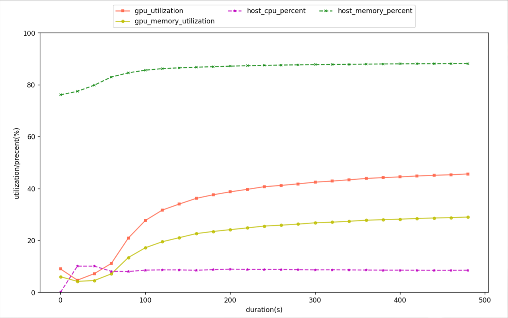

# 材料计算模型评估框架

### 目标

- 对所有模型，希望评估如下指标：
  - 训练耗时, 内存利用率, CPU占用率, GPU占用率, 模型参数量, FLOPS。

- 对于材料表示学习/材料表征/声子计算领域的属性预测任务，希望评估如下指标：
  - 回归任务：MAE, MSE, RMSE
  - 分类任务：ROC, AUC, Accuracy, Precision, Recall, F1_Score

- 对于材料生成任务，希望评估如下指标：
  - 有效率
  - 成功率
  - COV
  - EMD

 

### 支持的模型

- 目前希望支持材料表示学习/材料表征/声子计算/材料生成领域的部分模型：

  - SyMat, PDos, Matformer

  

### Demo结果

| Metrics/Model                         | **SyMat**                | Matformer | PDos(TODO) | Other |
| ------------------------------------- |--------------------------| ---- | ---- | ----- |
| **duration (s)**                      | 59.766264567151666       | 279.6747203390005 |      |       |
| **gpu:0/gpu_utilization (%)/mean**    | 44.72449783248215        | 57.34024483103515 |      |       |
| **gpu:0/memory_utilization (%)/mean** | 20.88040779519485        | 52.77920022097266 |      |       |
| **gpu:0/power_usage (W)/mean**        | 59.759263886971425       | 137.61544282401448 |      |       |
| **host/cpu_percent (%)/mean**         | 11.093333485733483       | 10.778991993015806 |      |       |
| **host/memory_percent (%)/mean**      | 61.39133474256576        | 57.97314795422511 |      |       |
| **Params** | 144 M (trainset) | 191 M (trainset) | | |
| **FLOPs** | 565 G (trainset) | 4507 G (trainset) | | |
| **MAE** | - | 0.0625682767954642 | | |
| **MSE** | - | 0.00973441919158266 | | |
| **RMSE** | - | 0.09866316025539959 | | |
| **有效率** | 0.9/1.0(numGen=10) | - | | |
| **COV** |  | - | | |
| **EMD** | 0.258/1.075 | - | | |
| ROC/AUC | - | (TODO) | | |
| Accuracy | - | (TODO) | | |
| Precision | - | (TODO) | | |
| Recall | - | (TODO) | | |
| F1_Score | - | (TODO) | | |

### 黑盒资源利用率

- SyMat模型 & perov_5数据集 & 50epoch的资源利用率采样情况

### 运行

~~~bash
# [SyMat, Matformer, PDos]
python main.py --modelName SyMat
~~~

### 需要用到的包：

~~~bash
### nvitop/thop/psutil
# nvitop
pip3 install --upgrade nvitop   # conda install -c conda-forge nvitop
# thop
pip install thop

# 除此之外，你还需要安装对应模型运行所需的包。如 Models/{modelName}/README 所示。
~~~